#Learn Roassal RSChart , in Pharo 13!
#example01Markers
```smalltalk
example01Markers
	<script: 'self new example01Markers open'>
	| x p |
	x := -3.14 to: 3.14 by: 0.01.
	p := RSLinePlot new.
	p x: x y: x sin * 0.22 + 0.5.
	
	p addDecoration: RSYMarkerDecoration new average.
	p addDecoration: RSYMarkerDecoration new min.
	p addDecoration: RSYMarkerDecoration new max.
	p addDecoration: RSXMarkerDecoration new max.
	p addDecoration: RSXMarkerDecoration new min.
	p addDecoration: (RSXMarkerDecoration new value: 0).
	p verticalTick asFloat.
	^ p
```
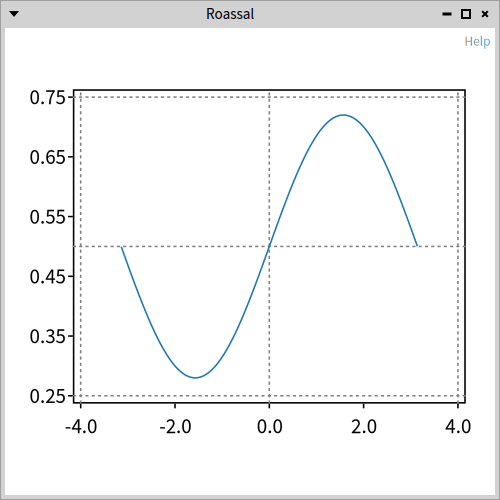

#example02ScatterPlot
```smalltalk
example02ScatterPlot
	<script: 'self new example02ScatterPlot show'>

	| classes p |
	classes := Collection withAllSubclasses.
	p := RSScatterPlot new x: (classes collect: #numberOfMethods) y: (classes collect: #linesOfCode).

	p xlabel: 'X Axis'.
	p ylabel: 'Y Axis'.
	p title: 'Hello World'.
	^ p
```


#example03Plot
```smalltalk
example03Plot
	<script: 'self new example03Plot show'>

	| plt p x |
	x := 0.0 to: 2 count: 100.
	plt := RSCompositeChart new.
	p := RSLinePlot new x: x y: (x raisedTo: 2).
	plt add: p.

	p := RSLinePlot new x: x y: (x raisedTo: 3).
	plt add: p.

	p := RSLinePlot new x: x y: (x raisedTo: 4).
	plt add: p.

	plt xlabel: 'X Axis'.
	plt ylabel: 'Y Axis'.
	plt title: 'Hello World'.
	^ plt
```


#example04WithTick
```smalltalk
example04WithTick
	<script: 'self new example04WithTick show'>
	| x chart |
	x := -10.0 to: 20.0 count: 100.
	chart := RSCompositeChart new
		add: (RSScatterPlot new x: x y: (x raisedTo: 3));
		add: (RSLinePlot new x: x y: (x raisedTo: 2));
		yourself.
	chart horizontalTick integer.
	chart verticalTick integer.
	^ chart
```


#example05WithTick
```smalltalk
example05WithTick
	<script: 'self new example05WithTick show'>
	| x c |
	x := 0.0 to: 14 count: 100.
	c := RSCompositeChart new.
	1 to: 7 do: [ :i |
		c add: (RSLinePlot new x: x y: (i * 0.3 + x) sin * (7 - i))
	].
	c verticalTick integer.
	c horizontalTick integer.
	^ c
```
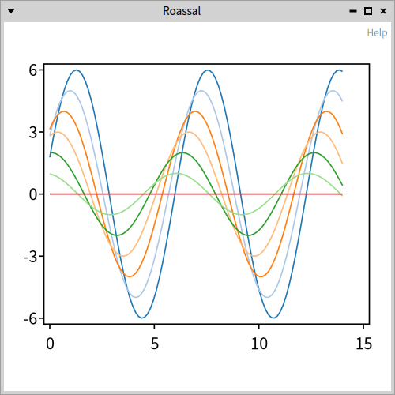

#example06CustomNumberOfTicks
```smalltalk
example06CustomNumberOfTicks
	<script: 'self new example06CustomNumberOfTicks show'>
	| x chart |
	x := -10.0 to: 20.0 count: 100.
	chart := RSCompositeChart new
		add: (RSScatterPlot new x: x y: (x raisedTo: 3));
		add: (RSLinePlot new x: x y: (x raisedTo: 2));
		yourself.
	chart horizontalTick numberOfTicks: 20;
			integer.
	chart verticalTick integer
			numberOfTicks: 2;
			doNotUseNiceLabel.
	^ chart
```
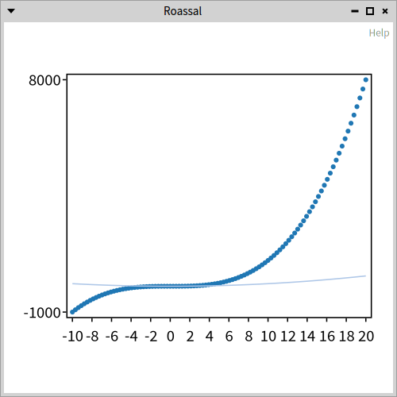

#example07AdjustingFontSize
```smalltalk
example07AdjustingFontSize

	<script: 'self new example07AdjustingFontSize open'>
	| x y c |
	x := -3.14 to: 3.14 by: 0.1.
	y := x sin.

	c := RSLinePlot new x: x y: y.
	c addDecoration: (RSChartTitleDecoration new
			 title: 'hello';
			 fontSize: 40).
	c addDecoration: (RSXLabelDecoration new
			 title: 'My X Axis';
			 fontSize: 12).
	c addDecoration: (RSYLabelDecoration new
			 title: 'My Y Axis';
			 fontSize: 15;
			 horizontal).
	^ c
```
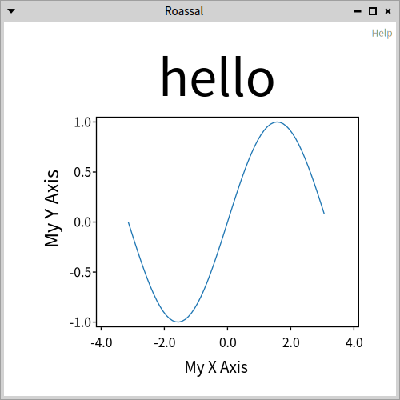

#example08TwoCharts
```smalltalk
example08TwoCharts
	<script: 'self new example08TwoCharts open'>
	| c c1 c2 |
	c := RSCanvas new.

	c1 := RSCompositeChart new.
	c1 add: (RSLinePlot new x: (1 to: 10) y: (1 to: 10) sqrt).
	c1 title: 'squared root'.
	c1 xlabel: 'X'.
	c1 ylabel: 'Y'.

	c2 := RSCompositeChart new.
	c2 add: (RSLinePlot new x: (1 to: 10) y: (1 to: 10) squared).
	c2 title: '^ 2'.
	c2 xlabel: 'X'.
	c2 ylabel: 'Y'.
	c add: c1 asShape; add: c2 asShape.
	RSHorizontalLineLayout on: c shapes.

	c @ RSCanvasController.
	^ c
```
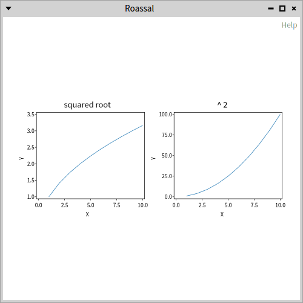

#example09LinearSqrtSymlog
```smalltalk
example09LinearSqrtSymlog
	<script: 'self new example09LinearSqrtSymlog open'>
	| c x y |
	c := RSCanvas new @ RSCanvasController.
	x := (-5 to: 500 by: 0.1).
	y := x.
	c addAll: (#(yLinear ySqrt yLog) collect: [ :sel |
		| chart |
		chart := RSCompositeChart new.
		chart add: (RSLinePlot new x: x y: y).
		chart verticalTick asFloat.
		chart removeHorizontalTicks.
		chart perform: sel.
		chart title: sel.
		chart asShape ]).
	RSHorizontalLineLayout on: c shapes.
	^ c
```
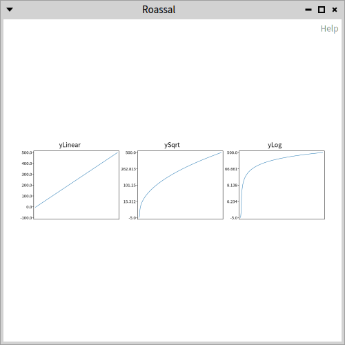

#example10BarPlot
```smalltalk
example10BarPlot
	<script: 'self new example10BarPlot open'>
	| p x y |

	x := 0.0 to: 2 count: 10.
	y := (x raisedTo: 2) - 2.
	p := RSBarPlot new x: x y: y.

	p horizontalTick doNotUseNiceLabel;
		numberOfTicks: x size - 1;
		asFloat.
	p xlabel: 'X Axis'.
	p verticalTick numberOfTicks: 10;
		asFloat.
	p ylabel: 'Y Axis'.
	p title: 'Histogram'.
	^ p
```
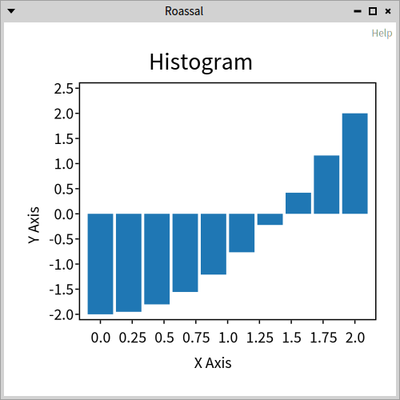

#example11BarplotCombinedWithLine
```smalltalk
example11BarplotCombinedWithLine
	<script: 'self new example11BarplotCombinedWithLine open'>
	| c x y |
	x := 0.0 to: 2 count: 10.
	y := (x raisedTo: 2) - 2.
	c := RSCompositeChart new.

	c add: (RSBarPlot new x: x y: y).
	c add: (RSLinePlot new x: x y: y; color: Color red).
	c horizontalTick asFloat.
	c verticalTick numberOfTicks: 10;
		asFloat.
	c xlabel: 'X Axis'.
	c ylabel: 'Y Axis'.
	c title: 'Bar char'.
	^ c
```
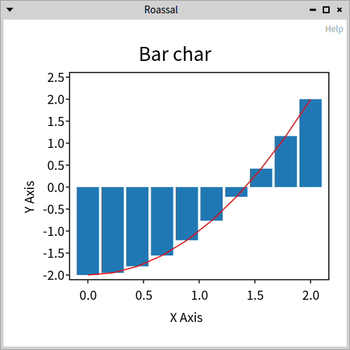

#example12ScatterPlotAndNormalizer
```smalltalk
example12ScatterPlotAndNormalizer

	<script: 'self new example12ScatterPlotAndNormalizer open'>
	| x y z r p |
	x := OrderedCollection new.
	y := OrderedCollection new.
	z := OrderedCollection new.
	r := Random seed: 42.
	1 to: 100 do: [ :i |
		x add: i + (r next * 10 + 1) asInteger.
		y add: i + (r next * 10 + 1) asInteger.
		z add: i + (r next * 10 + 1) asInteger. ].

	p := RSScatterPlot new x: x y: y.
	p color: Color blue translucent.

	p horizontalTick doNotUseNiceLabel asFloat: 3.
	p build.
	p ellipses models: z.
		RSNormalizer size
			shapes: p ellipses;
			from: 2;
			to: 10;
			normalize: #yourself.
		RSNormalizer color
			shapes: p ellipses;
			normalize: #yourself.
	p ellipses translucent.
	^ p canvas
```
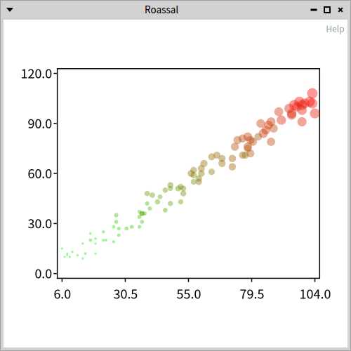

#example13AreaPlot
```smalltalk
example13AreaPlot
	<script: 'self new example13AreaPlot open'>
	| x y1 y2 p canvas charts |
	x := 0 to: 2 by: 0.01.
	y1 := (2 * Float pi * x) sin.
	y2 := 1.2 * (4 * Float pi * x) sin.

	canvas := RSCanvas new.
	charts := {'Between y1 and 0'-> (y1 -> 0).
	'Between y2 and 1'-> (y1 -> 1).
	'Between y1 and y2'-> (y1 -> y2)} collect: [ :assoc |
		p := RSAreaPlot new x: x y1: assoc value key y2: assoc value value.
		p extent: 500@100.
		p horizontalTick numberOfTicks: 10; asFloat.
		p verticalTick numberOfTicks: 3; asFloat.
		p ylabel: assoc key.
		p asShape	].
	RSVerticalLineLayout on: charts.
	canvas addAll: charts.
	canvas @ RSCanvasController.
	^ canvas
```
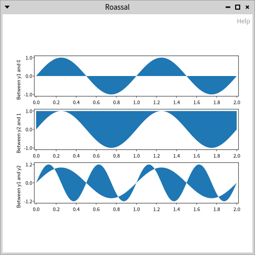

#example14AreaPlotWithError
```smalltalk
example14AreaPlotWithError
	<script: 'self new example14AreaPlotWithError open'>
	| x y polyfit res y_est y_err c scatter |
	x := 0 to: 10.
	y := #(3.9 4.4 10.8 10.3 11.2 13.1 14.1 9.9 13.9 15.1 12.5).
	polyfit := [ :x1 :y1 :n |
		"TODO"
		"Need a real polyfit implementation for any n"
		"maybe not in Roassal maybe in polymath"
		"https://en.wikipedia.org/wiki/Curve_fitting"
		0.9-> 6].
	res := polyfit value: x value: y value: 1.
	y_est := res key * x + res value.

	y_err := x stdev * ( (1/x size) +
		(( (x - x average) raisedTo: 2) /
		((x - x average) raisedTo: 2) sum) ) sqrt.


	c := RSCompositeChart new.
	c padding: 10@10.
	c add: (RSAreaPlot new x: x y1: y_est + y_err y2: y_est - y_err; color: (Color blue alpha: 0.1) ).
	c add: (RSLinePlot new x: x y: y_est; color: Color red).
	c add: (scatter := RSScatterPlot new x: x y: y).
	scatter color: Color red.
	c horizontalTick numberOfTicks: 10; asFloat.
	c verticalTick numberOfTicks: 3; asFloat.
	^ c
```
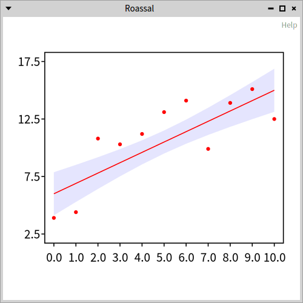

#example15AreaBox
```smalltalk
example15AreaBox
	<script: 'self new example15AreaBox open'>
	| x y1 y2 c |
	x := #(0 1 2 3).
	y1 := #(0.8 0.8 0.2 0.2).
	y2 := #(0 0 1 1).
	c := RSCompositeChart new.
	c extent: 150@50.
	c add: (RSAreaPlot new x: x y1: y1 y2: y2).
	c add: (RSLinePlot new x: x y: y1; color: Color red; format: 's--').
	c add: (RSLinePlot new x: x y: y2; color: Color orange; format: 'o--').
	c horizontalTick numberOfTicks: 7; asFloat.
	c verticalTick asFloat.

	^ c
```
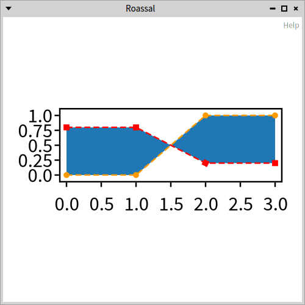

#example16Series
```smalltalk
example16Series
	<script: 'self new example16Series open'>
	| x cumsum c b y error |
	x := 1 to: 100.
	cumsum := [:arr | | sum |
		sum := 0.
		arr collect: [ :v | sum := sum + v. sum ] ].

	c := RSCompositeChart new.
	c extent: 400@400.

	b := RSLegend new.
	b container: c canvas.
	b layout horizontal gapSize: 30.
	#(
	series1 red
	series2 blue) pairsDo: [ :label :color |
		y := (x collect: [ :i | 50 atRandom - 25 ]).
		y := cumsum value: y.
		error := x.

		c add: (RSAreaPlot new
			x: x y1: y + error y2: y - error;
			color: (color value: Color) translucent).
		c add: (RSLinePlot new x: x y: y; format: 'o';
			color: (color value: Color)).
		b text: label withBoxColor: (color value: Color)
		 ].
	c build.
	b build.

	^ c canvas
```
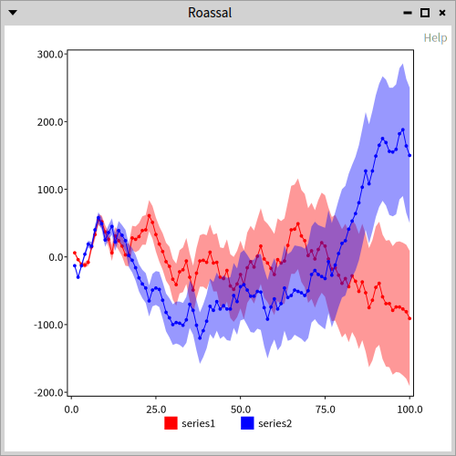

#example17CLPvsUSD
```smalltalk
example17CLPvsUSD
	<script: 'self new example17CLPvsUSD open'>
	| dates y data x c plot paint horizontal |
	dates := OrderedCollection new.
	y := OrderedCollection new.
	data :=
	{'04-jun-2020'.	769.13.
	'03-jun-2020'.	782.86.
	'02-jun-2020'.	796.46.
	'01-jun-2020'.	806.32.
	'29-may-2020'.	812.74.
	'28-may-2020'.	816.47.
	'27-may-2020'.	802.10.
	'26-may-2020'.	803.74.
	'25-may-2020'.	805.75.
	'22-may-2020'.	806.17.
	'20-may-2020'.	819.08.
	'19-may-2020'.	820.65.
	'18-may-2020'.	823.86.
	'15-may-2020'.	822.93.
	'14-may-2020'.	820.38.
	'13-may-2020'.	821.88.
	'12-may-2020'.	826.05.
	'11-may-2020'.	827.65.
	'08-may-2020'.	836.27.
	'07-may-2020'.	839.08.
	'06-may-2020'.	832.84.
	'05-may-2020'.	838.74.
	'04-may-2020'.	837.92} reverse.
		data pairsDo: [ :f :d |
			dates add: d.
			y add: f ].
	x := 1 to: dates size.
	c := RSCompositeChart new.
	c extent: 300@200.
	plot := RSAreaPlot new x: x y1: y y2: 750.
	paint := LinearGradientPaint fromArray:
		{0-> (Color green alpha: 0.3).
		0.8 -> Color transparent}.
	paint start: 0@ -100; stop: 0@ 100.
	plot shape paint: paint.
	c add: plot.
	plot := RSLinePlot new x: x y: y.
	plot color: Color green muchDarker.
	plot width: 2.
	plot joinRound.
	plot markerEnd: (RSEllipse new size: 10).
	c add: plot.

	horizontal := c horizontalTick fromNames: dates.
	horizontal configuration fontSize: 4.
	horizontal useDiagonalLabel.
	c verticalTick numberOfTicks: 10; asFloat.
	c title: 'CLP vs USD'.
	^ c
```
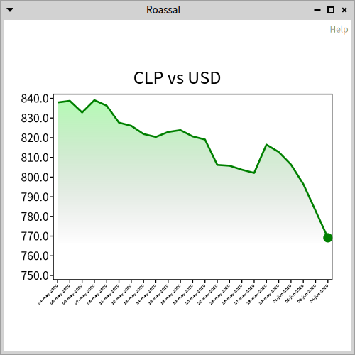

#example18Animation
```smalltalk
example18Animation

	<script: 'self new example18Animation inspect'>
	| c canvas line points current lineAnimation area paint afterline yticks xticks |
	c := self example17CLPvsUSD.
	c build.
	canvas := c canvas.

	"line"
	line := canvas shapes detect: [ :s | s class = RSPolyline ].
	points := line controlPoints.
	current := OrderedCollection new.
	current
		add: points first;
		add: points second.
	line controlPoints: current.
	lineAnimation := (2 to: points size)
		                 collect: [ :i |
			                 canvas transitionAnimation
				                 duration: 100 milliSeconds;
				                 from: (points at: i - 1);
				                 to: (points at: i);
				                 onStepDo: [ :t |
					                 current
						                 removeLast;
						                 add: t.
					                 line controlPoints: current ];
				                 when: RSAnimationEndEvent
				                 do: [ current add: (points at: i) ]
				                 for: self ]
		                 as: OrderedCollection.
	"area"
	area := canvas shapes detect: [ :s | s class = RSSVGPath ].
	paint := area paint.
	area noPaint.
	afterline := canvas parallelAnimation.
	afterline add: (canvas transitionAnimation onStepDo: [ :t |
			 area paint: (Color transparent interpolateTo: paint at: t) ]).
	lineAnimation add: afterline.
	canvas animationFrom: lineAnimation.

	"ticks"
	yticks := canvas shapes select: [ :s | s class = RSLabel ].
	yticks do: [ :s | s bold ].
	yticks := yticks groupedBy: [ :s | s matrix sy ].
	xticks := yticks values first.
	yticks := yticks values second.
	xticks doWithIndex: [ :s :index |
		canvas newAnimation
			delay: (index - 1 * 100) milliSeconds;
			duration: 200 milliSeconds;
			from: Color transparent;
			to: s color;
			on: s set: #color:.
		s color: Color transparent ].
	yticks doWithIndex: [ :s :index |
		s noPaint.
		afterline add: (canvas transitionAnimation
				 delay: (index * 300) milliSeconds;
				 duration: 2 second;
				 easing: RSEasingInterpolator elasticOut;
				 from: -100 @ s position y;
				 to: s position;
				 onStepDo: [ :p |
					 s color: Color black.
					 s position: p ]) ].
	^ canvas
```
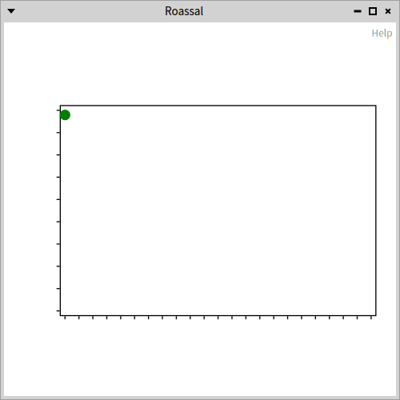

#example19PositiveNetagiveBarPlots
```smalltalk
example19PositiveNetagiveBarPlots
	<script: 'self new example19PositiveNetagiveBarPlots open'>
	| c d d2 |

	c := RSCompositeChart new.

	d := RSBarPlot new.
	d color: Color green darker darker darker translucent.
	d y: #(4 10 5 9).
	c add: d.

	d2 := RSBarPlot new.
	d2 color: Color red darker darker darker translucent.
	d2 y: #(-5 -6 -3 -3).
	c add: d2.

	c verticalTick integer.

	c addDecoration: (RSYLabelDecoration new title: 'Difference'; rotationAngle: -90; offset: -25 @ 0).
	c addDecoration: (RSXLabelDecoration new title: 'Evolution').

	^ c
```
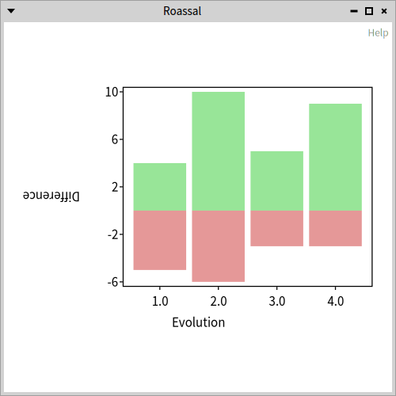

#example20Grid
```smalltalk
example20Grid
	<script: 'self new example20Grid open'>
	| c x y vertical horizontal |

	x := 0 to: 10.
	y := x raisedTo: 2.
	c := RSAbstractChart lineX: x y: y.
	vertical := c verticalTick.
	vertical shape dashed.
	vertical configuration tickSize: c extent x negated.
	horizontal := c horizontalTick.
	horizontal configuration tickSize: c extent y negated.
	c build.
	^ c canvas
```
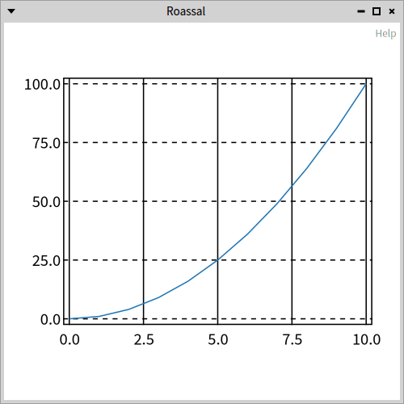

#example21Popup
```smalltalk
example21Popup
	<script: 'self new example21Popup open'>
	| x cumsum c  y error popup |
	x := 1 to: 100.
	cumsum := [:arr | | sum |
		sum := 0.
		arr collect: [ :v | sum := sum + v. sum ] ].

	c := RSCompositeChart new.
	c extent: 800@400.

	popup := RSPopupDecoration new.
	c addDecoration: popup.

	#(
	series1 red
	series2 blue) pairsDo: [ :label :color |
		| col plot |
		y := (x collect: [ :i | 50 atRandom - 25 ]).
		y := cumsum value: y.
		error := x.
		col := color value: Color.

		c add: (RSAreaPlot new
			x: x y1: y + error y2: y - error;
			color: col translucent).
		c add: (plot := RSLinePlot new x: x y: y; format: 'o';
			color: col;
			yourself).
		popup chartPopupBuilder
			for: plot text: label color: col.
		 ].

	c build.

	^ c canvas
```
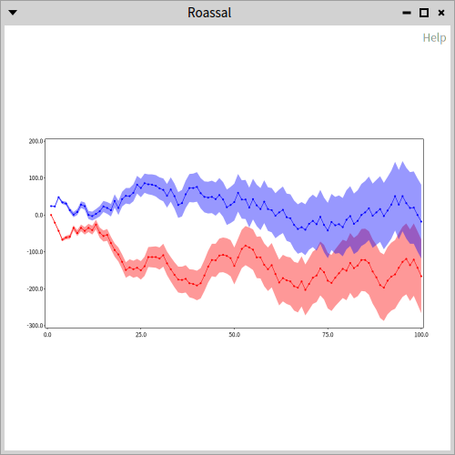

#example22CustomPopup
```smalltalk
example22CustomPopup
	<script: 'self new example22CustomPopup open'>
	| values names x y popup c value date group |
	values := {
	'25-nov-2020' -> 772.83.
	'24-nov-2020' -> 765.96.
	'23-nov-2020' -> 761.55.
	'20-nov-2020' -> 758.62.
	'19-nov-2020' -> 758.10.
	'18-nov-2020' -> 767.05.
	'17-nov-2020' -> 767.86.
	'16-nov-2020' -> 766.70.
	'13-nov-2020' -> 757.43.
	'12-nov-2020' -> 757.42.
	'11-nov-2020' -> 760.90.
	'10-nov-2020' -> 753.75.
	'09-nov-2020' -> 759.25.
	'06-nov-2020' -> 752.01.
	'05-nov-2020' -> 757.16.
	'04-nov-2020' -> 758.53.
	'03-nov-2020' -> 769.17.
	'02-nov-2020' -> 771.92.
	'30-oct-2020' -> 770.45.
	'29-oct-2020' -> 775.56.
	'28-oct-2020' -> 772.05.
	'27-oct-2020' -> 779.57.
	'26-oct-2020' -> 777.72.
	'23-oct-2020' -> 781.41.
	'22-oct-2020' -> 784.07.
	'21-oct-2020' -> 786.66.
	'20-oct-2020' -> 788.27.
	'19-oct-2020' -> 795.68.
	'16-oct-2020' -> 801.91.
	'15-oct-2020' -> 798.56.
	'14-oct-2020' -> 797.66.
	'13-oct-2020' -> 796.05.
	'09-oct-2020' -> 797.25.
	'08-oct-2020' -> 795.05.
	'07-oct-2020' -> 797.35.
	 } reversed.
	names := values collect: #key.
	x := 1 to: values size.
	y := values collect: #value.
	popup := RSPopupDecoration new.
	c := RSCompositeChart new.
	c extent: 400 @ 150.
	c add: (RSAreaPlot new
			 x: x y1: y y2: 750;
			 color: ((LinearGradientPaint fromArray: {
							   (0 -> Color green translucent).
							   (0.75 -> Color transparent) })
					  start: 0 @ -100;
					  stop: 0 @ 100;
					  yourself)).
	c add: ((RSAbstractChart lineX: x y: y) color: Color gray).

	c horizontalTick
		fromNames: names;
		useDiagonalLabel.
	c addDecoration: popup.
	popup chartPopupBuilder:
		(RSBlockChartPopupBuilder new rowShapeBlock: [ :plot :point |
			 value := RSLabel new
				          text: point y;
				          bold.
			 date := RSLabel new text: (names at: point x).
			 group := {
				          value.
				          date }.
			 RSHorizontalLineLayout on: group.
			 group asShape ]).
	^ c
```
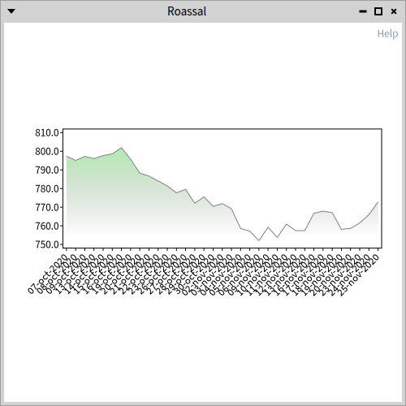

#example23PopupInScatterPlot
```smalltalk
example23PopupInScatterPlot
	<script: 'self new example23PopupInScatterPlot open'>
	| chart plot data classes  |
	chart := RSCompositeChart new.
	classes := Collection withAllSubclasses.
	data := classes collect: [:cls | cls linesOfCode sqrt ].
	plot := RSScatterPlot new y: data.
	chart add: plot.
	chart padding: 10.
	chart build.
	plot ellipses with: classes do: [ :e :cls | e model: cls ].
	plot ellipses @ (RSPopup themeText: [:model |
		model name, String cr, 'LOC: ', model linesOfCode asString]).
	^ chart
```
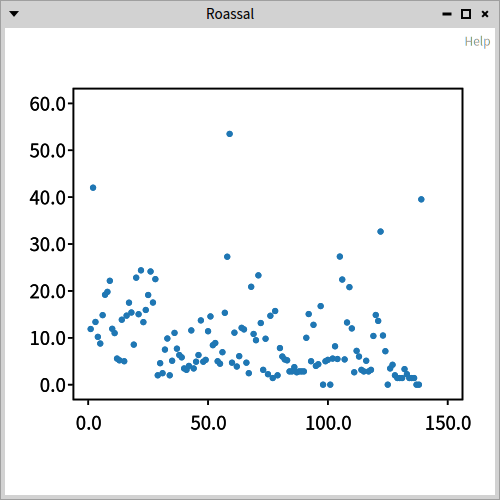

#example24SpineLine
```smalltalk
example24SpineLine

	<script: 'self new example24SpineLine open'>
	| x c y spine |
	x := -3.14 to: 3.14 by: 0.01.
	y := x sin * 0.22 + 0.2.
	c := RSAbstractChart lineX: x y: y.
	c extent: 400 @ 300.
	c spineDecoration: (spine := RSLineSpineDecoration new).
	spine shape format: '^'.
	c padding: 10.
	^ c
```
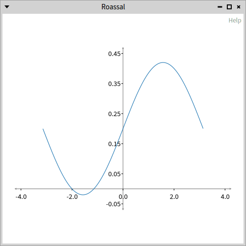

#example25CustomBackground
```smalltalk
example25CustomBackground
	<script: 'self new example25CustomBackground open'>
	| plot c scale color form paint |
	plot := self example10BarPlot.
	c := RSCanvas new.
	scale := NSScale linear
		domain: { 1. 25 };
		range: { 10. 3 }.
	color := (Color colorFrom: '#20325a') alpha: 0.2.
	1 to: 25 do: [ :y |
		1 to: 50 do: [ :x | | e |
			e := RSEllipse new.
			e position: x @ y * 10.
			e size: (scale scale: y).
			e color: color.
			c add: e
		]
	].
	c zoomToFit.
	form := c asForm.
	paint := AthensCairoPatternSurfacePaint createForSurface: (AthensCairoSurface fromForm: form).
	paint origin: (form extent / 2) negated.
	plot spineDecoration masterShape paint: paint.
	^ plot
```
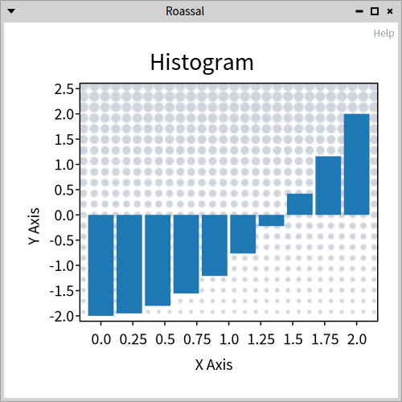

#example26DensityPlot
```smalltalk
example26DensityPlot
	<script: 'self new example26DensityPlot open'>
	| prod data paint densityPlot points linePlot plot |
	prod := [:a | Array new: a value withAll: a key ].
	data :=(prod value: 1.5->7), (prod value: 2.5->2),
		(prod value: 3.5->8), (prod value: 4.5->3),
		(prod value: 5.5->1), (prod value: 6.5->10).

	paint := LinearGradientPaint fromArray: { 0-> '#050321'. 1-> '#435562'}.
	paint start: 25@ 50; stop: 0@ -50.
	densityPlot := RSDensityPlot data: data.
	densityPlot masterShape paint: paint.

	densityPlot bandwidth: 0.5.
	points := densityPlot curvePoints.
	linePlot := RSLinePlot points: points.
	linePlot color: Color red.
	plot := densityPlot + linePlot.
	plot container background: (Color colorFrom: '#050321').
	(plot title: 'se multiplient' asUppercase) masterShape
		bold;
		fontFamily: 'Impact';
		fontSize: 20.

	(plot title: 'Les opportunités' asUppercase) masterShape
		fontFamily: 'Avenir Next'.

	plot styler: (RSChartStyler new
		tickColor: Color white;
		spineColor: Color white;
		textColor: Color white).

	plot container newAnimation
		repeat;
		from: 0;
		to: 1000;
		onStepDo: [ :t |
			linePlot line dashArray: { t. 1000 }.
			 ];
		when: RSAnimationStartEvent do: [:evt |
			linePlot line color: (linePlot line color = Color red
				ifTrue: [Color green]
				ifFalse: [Color red])
			] for: plot.

	^ plot
```
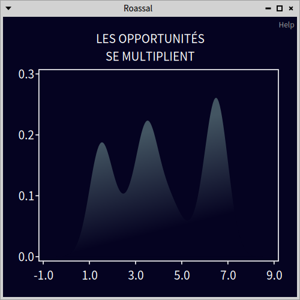

