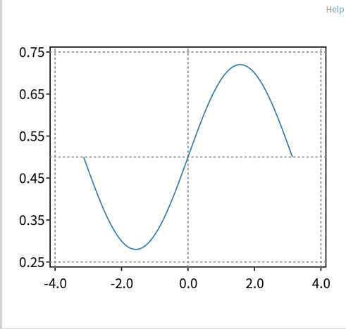
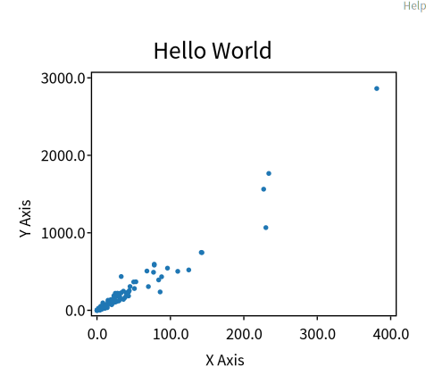
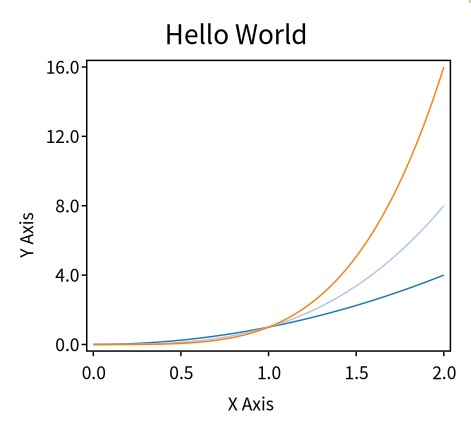
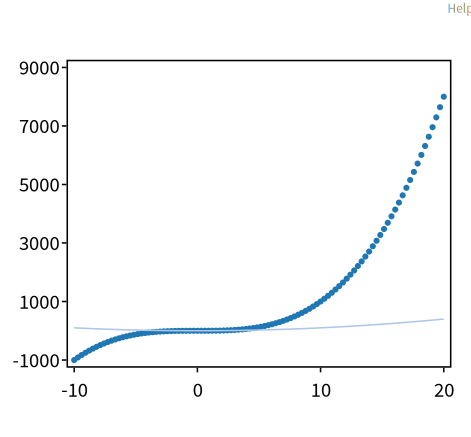

# RSChart 

```smalltalk
package Roassal-Chart-Examples
class RSChartExample

pharo 13 with full roassal loaded
```

## example01Markers

```smalltalk
example01Markers
	<script: 'self new example01Markers open'>
	| x p |
	x := -3.14 to: 3.14 by: 0.01.
	p := RSLinePlot new.
	p x: x y: x sin * 0.22 + 0.5.
	
	p addDecoration: RSYMarkerDecoration new average.
	p addDecoration: RSYMarkerDecoration new min.
	p addDecoration: RSYMarkerDecoration new max.
	p addDecoration: RSXMarkerDecoration new max.
	p addDecoration: RSXMarkerDecoration new min.
	p addDecoration: (RSXMarkerDecoration new value: 0).
	p verticalTick asFloat.
	^ p
```


## example02ScatterPlot
```smalltalk
example02ScatterPlot
	<script: 'self new example02ScatterPlot show'>

	| classes p |
	classes := Collection withAllSubclasses.
	p := RSScatterPlot new x: (classes collect: #numberOfMethods) y: (classes collect: #linesOfCode).

	p xlabel: 'X Axis'.
	p ylabel: 'Y Axis'.
	p title: 'Hello World'.
	^ p
```



## example03Plot

```smalltalk
example03Plot
	<script: 'self new example03Plot show'>

	| plt p x |
	x := 0.0 to: 2 count: 100.
	plt := RSCompositeChart new.
	p := RSLinePlot new x: x y: (x raisedTo: 2).
	plt add: p.

	p := RSLinePlot new x: x y: (x raisedTo: 3).
	plt add: p.

	p := RSLinePlot new x: x y: (x raisedTo: 4).
	plt add: p.

	plt xlabel: 'X Axis'.
	plt ylabel: 'Y Axis'.
	plt title: 'Hello World'.
	^ plt
```



## example04WithTick

```
example04WithTick
	<script: 'self new example04WithTick show'>
	| x chart |
	x := -10.0 to: 20.0 count: 100.
	chart := RSCompositeChart new
		add: (RSScatterPlot new x: x y: (x raisedTo: 3));
		add: (RSLinePlot new x: x y: (x raisedTo: 2));
		yourself.
	chart horizontalTick integer.
	chart verticalTick integer.
	^ chart
```



## example05WithTick


## example06CustomNumberOfTicks

## example07AdjustingFontSize

## examlpe08TwoCharts

## example09LinearSqrtSymlog

## example10BarPlot

