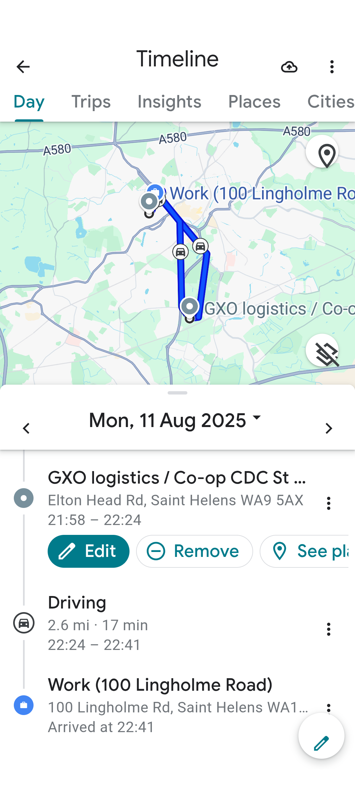

# smalltalk
everything smalltalk related

## sbe-quinto

fantastic bit of guile scheme lisp code to solve the quinto 10 x 10 game 

uses un-hygienic lisp macros extensively

smalltalk by example (sbe) quinto game 

quinto is a game with grid 

player clicks a square , toggles neighbour squares

a neighbour is a square touching clicked square

a neighbour is vertical above below , horizontal left right 

a neighbour is never diagonal 

aim is to make entire board blue

is this a solved problem ?

try a smaller board and see if it can be solved

